# 💚 Virtual_File_System 💛

## 👉 Introduction and Summary 
### 1️⃣ Introduction
+ Ở bài trước chúng ta đã biết về Makefile trong linux cũng như các cú pháp và các thực hành với nó. Nếu các bạn chưa xem thì vào link này nha [003_Makefile.md](../003_Makefile/003_Makefile.md). Ở bài này chúng ta sẽ tìm hiểu về Virtual File System. Các OS họ Unix như Linux, MacOS, Qnx đều có tư tưởng là quản lý mọi thứ bằng file, ví dụ như các device thì cũng coi như là file (device file system), network file system... Vì nguyên nhân trên nên để hiểu được sâu luồng tương tác từ user đến hardware thì ta cần phải hiểu được luồng đi của File system trong linux.
### 2️⃣ Summary
Nội dung của bài viết gồm có những phần sau nhé 📢📢📢:
- [I. Introduction and Summary](#👉-introduction-and-summary)
    - [1. Introduction](#1️⃣-introduction)
    - [2. Summary](#2️⃣-summary)
- [II. Contents](#👉-contents)
    - [1. VFS Virtal File System](#1️⃣-vfs-virtual-file-system)
    - [2. File System](#2️⃣-file-system)
    - [3. File Lock](#3️⃣-file-lock)
- [III. Conclusion](#✔️-conclusion)
- [IV. Exercise](#💯-exercise)
- [V. NOTE](#📺-note)
- [VI. Reference](#📌-reference)

## 👉 Contents
### 1️⃣ VFS Virtal File System

***Giới thiệu***
+ Các version đầu của Unix chưa có khái niệm Virtual File System mà chỉ có khái niệm File System, File system để quản lý đọc ghi trên ổ cứng còn các cái như network, bàn phím thì không có file system. Nhìn chung system được thiết kế riêng cho target hardware. Bây giờ thì mọi thứ đều coi là file như device file system, network file system... Mà mỗi loại thiết bị sẽ có những đặc điểm, tính chất riêng như network thì cần timeout để đồng bộ thông tin... Vì cơ chế đọc ghi dữ liệu trên mỗi loại thiết bị khác nhau là khác nhau nên Linux mới sinh ra các loại file system khác nhau. Khi có Virtual File System rồi thì việc lập trình sẽ dễ dàng hơn, ví dụ như socket thì chúng ta cũng chỉ open và đọc ghi với socket tương tự như file. 

+ Vì vậy trong các OS về sau đã đưa ra 1 cơ chế gọi là VFS(Virtual File System). VFS nghĩa là có nhiều FS(File System) như nfs(Network File System), ext4(Hard disk) chạy trên các hardware riêng biệt, và sẽ có 1 lớp ở trên cùng để gộp chung lại các FS(File System) gọi là VFS(Virtual File System). Sau khi có VFS rồi thì tầng User sử dụng chỉ còn 1 khái niệm duy nhất là FILE
<p align="center">
  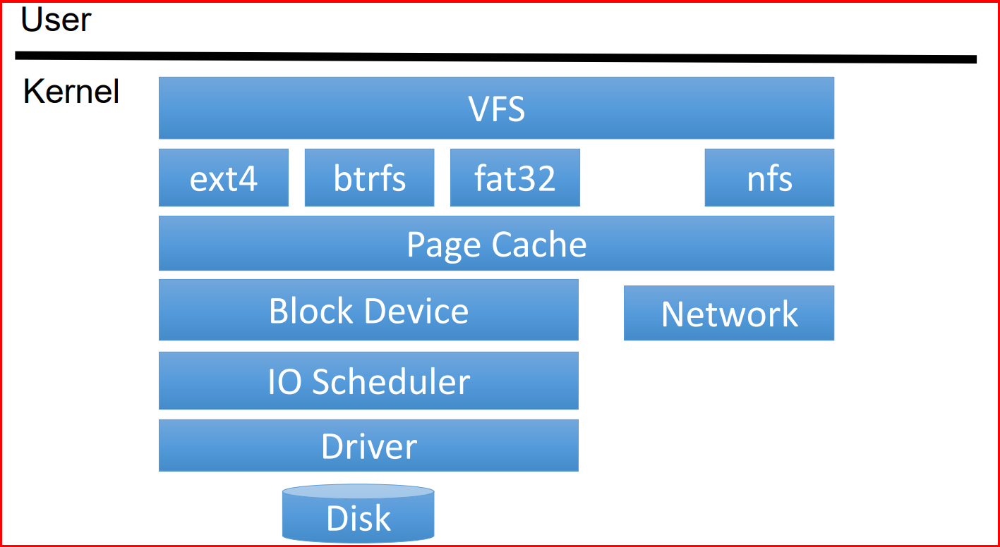   
</p>

+ Cấu trúc dữ liệu cơ bản mà VFS cung cấp: VFS cung cấp 4 struct như bên dưới
    + Super Block: Chứa thông tin của File System đấy. Như network thì sẽ chứa thông tin về timeout, IP, Tốc độ truyền ... Đồng thời nó cũng quyết định luôn khi nào ghi data từ Cache vào disk, vì nhiều khi mình đọc ghi file thì chỉ là đang đọc ghi vào cache thôi chứ không phải là disk thực.
    + inode (index node): Mỗi 1 file được tạo ra thì đều có 1 inode tương ứng kèo theo, và nó chứa các metadata của file đấy như quyền, size, ngày chỉnh sửa, tên ...
    + dentry (directory entry): Thể hiện sự liên kết file như file này liên kết đến file nào, file này nằm trong folder nào.
    + file object: pointer to dentry and cursor (file offset)
    + File description: Chứa các hàm đọc ghi của file đấy
<p align="center">
  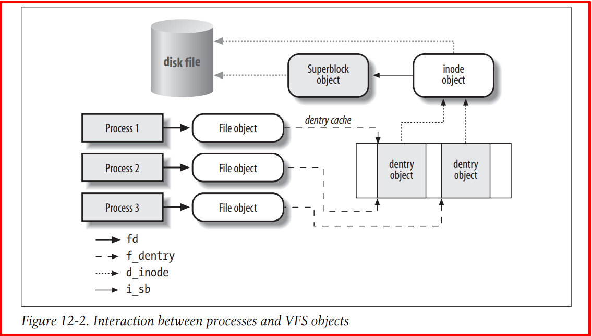   
</p>

***Symbolic links và Hard link***
+ Symbolic links hay còn gọi là softlink: 
    + Nó giống như Shortcut bên windows
    + Được tạo bằng system call symlink()
    + Tạo ra 1 file liên kết tương trưng để trỏ tới file kia
    + ln -s [file nguồn] [file đích]
    + Ta tạo file softlink.txt để softlink tới file hula.txt mà số inode của 2 file là khác nhau
    + Khi này ta đọc file softlink.txt sẽ ra nội dung của file hula.txt
    + Khi xóa file hula.txt thì sẽ không đọc file softlink.txt được nữa vì còn gì nữa đâu mà link
<p align="center">
  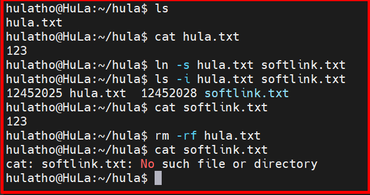   
</p>

+ Hard link: 
    + Khi ta tạo 1 file mới trên Disk thì mặc định ta sẽ có 1 inode trỏ tới file đó. Tuy nhiên khi ta tạo thêm 1 hardlink nữa thì khi này sẽ có thêm 1 inode được tạo và khi này cả 2 inode đều trỏ tới file trên disk kia
    + Cú pháp: ln [file nguồn] [file đích]
    + Ta thấy inode của 2 file hula.txt và hardlink.txt là như nhau
    + Khi xóa file hula.txt thì file hardlink.txt vẫn còn nguyên
    + Khi sử dụng lệnh rm để xóa file thì làm giảm đi một hard link. Khi số lượng hard link giảm còn 0 thì không thể truy cập tới nội dung của file được nữa
<p align="center">
  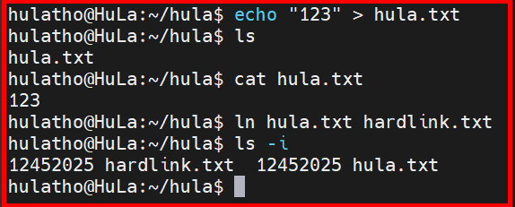   
</p>

+ So sánh Symbolic links và Hard link
<p align="center">
  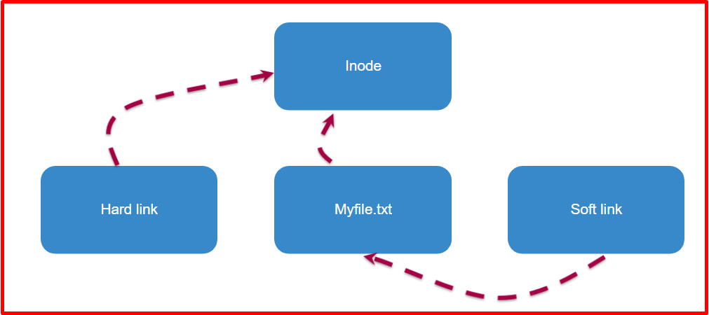   
</p>
<p align="center">
  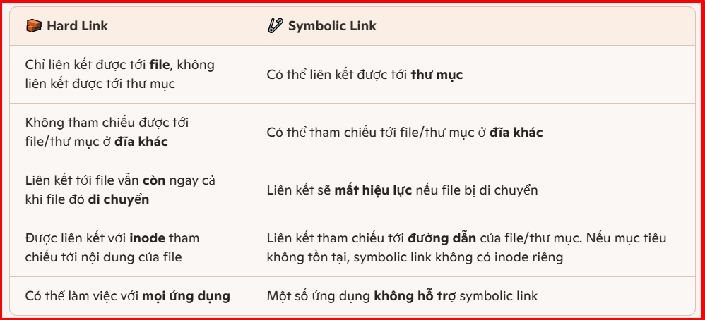   
</p>

***Trace luồng***
+ Để trace luồng VFS ta sẽ đi ngược lại theo ảnh dưới
<p align="center">
     
</p>

+ Vào link bất kì 1 kernel sau đó vào fs/ubifs để trace thằng này: https://github.com/renesas-rz/rz_linux-cip/tree/linux-4.19.y-cip/fs/ubifs

+ Vào file super.c và trace từ function ubifs_init, khi này ta thấy nó đi register 1 filesystem là ubifs_fs_type, ta sẽ đi ctrl F thằng ubifs_fs_type này

<p align="center">
  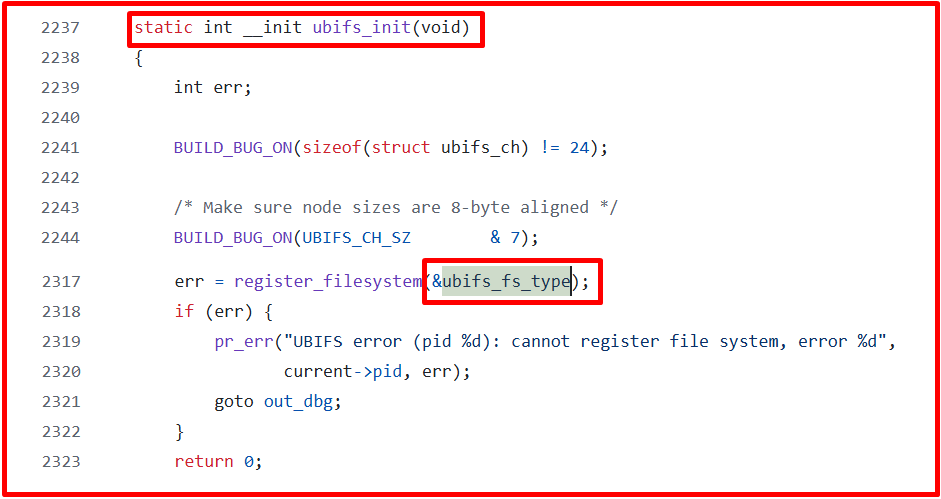   
</p>

+ Khi này, ta sẽ thấy struct "struct file_system_type ubifs_fs_type", mà trong struct này có phần tử mount tới ubifs_mount. Ta lại đi ctrl F tiếp thằng ubifs_mount
<p align="center">
  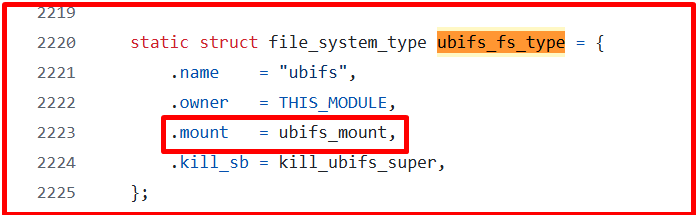   
</p>

+ Thằng ubifs_mount là 1 function, và nó sẽ return về 1 struct dentry để mô tả cây thư mục này đang chứa chứa những gì. Tiếp theo, trong function này sẽ gọi function ubifs_fill_super để điền các thông tin của Super Object vào. Vậy ta sẽ đi ctrl F thằng ubifs_fill_super
<p align="center">
  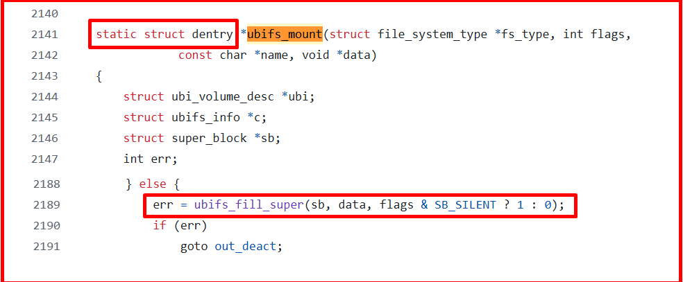   
</p>

+ Trong function ubifs_fill_super sẽ đi gán các cái super operation vào. Vậy ta lại đi ctrl F thằng ubifs_super_operations để xem có những operation gì
<p align="center">
  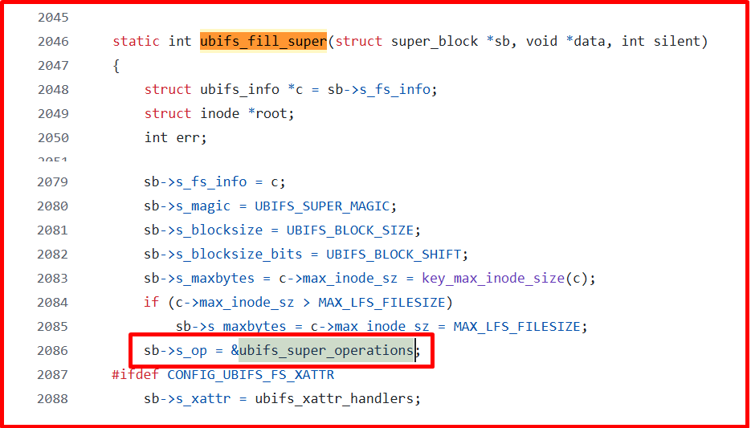   
</p>

+ Có thể thấy các operation của ubifs_super_operations như ảnh dưới. Vây giờ ta sẽ đi làm thằng dentry và kobject nữa là đủ luồng.
<p align="center">
  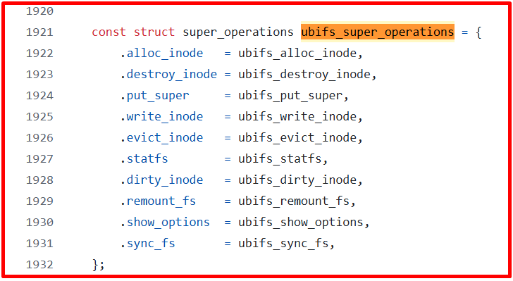   
</p>

+ File [file.c](https://github.com/renesas-rz/rz_linux-cip/blob/linux-4.19.y-cip/fs/ubifs/file.c) trong fs/ubifs, ta sẽ thấy struct const struct file_operations ubifs_file_operations như bên dưới. Mà trong file [dir.c](https://github.com/renesas-rz/rz_linux-cip/blob/linux-4.19.y-cip/fs/ubifs/dir.c) lại có function ubifs_new_inode, function này sẽ gán các hoạt động của inode operation với ubifs_file_operations.
<p align="center">
  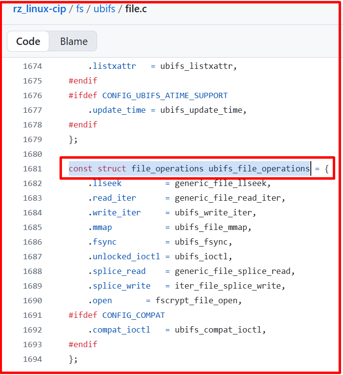   
</p>
<p align="center">
  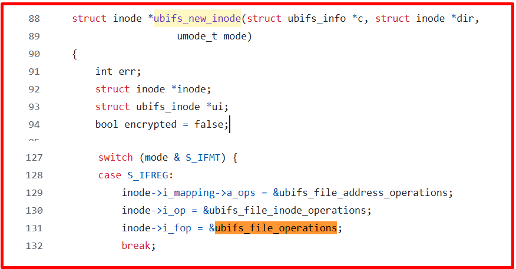   
</p>

### 2️⃣ File System

***Các loại file trong Linux***
```s
Regular file: là các file thông thường như text file, executable file.​
Directories file: file chứa danh sách các file khác.​
Character Device file: file đại diện cho các thiết bị không có địa chỉ vùng nhớ.​
Block Device file: file đại diện cho các thiết bị có địa chỉ vùng nhớ.​
Link files: file đại diện cho một file khác.​
Socket file: file đại diện cho 1 socket.​
Pipe file: file đại diện cho 1 pipe.​
```

+ Command hiển thị thông tin file:
    + ls -l
    + ls -a
    + ls -h

<p align="center">
  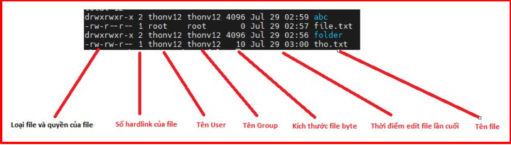   
</p>

```s
- Chữ R:    là Regular file​
- Chữ D:    là Directories file​
- Chữ C:    là Character Device file​
- Chữ B:    là Block Device file​
- Chữ L:    là Link files​
- Chữ S:    là Socket file​
- Chữ P:    là Pipe file​
- Dấu "-":  là file thông thường​
```

***Thay đổi quyền file***
+ Để thay đổi quyền của file ta dùng câu lệnh chmod. Có thể vào [LINK NÀY](https://chmod-calculator.com/​) để xem quyền trực quan hơn
```s
chmod 744 Name_file​
chmod o+r test.txt: thêm quyền read.​
chmod u-r test.txt: bỏ quyền read.​
```
<p align="center">
  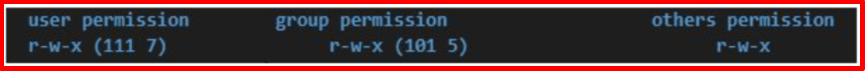   
</p>
<p align="center">
  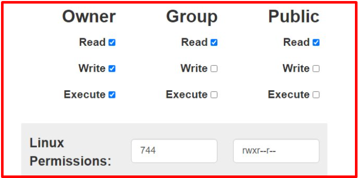   
</p>

***Read Write file***
+ Kernel cung cấp các system call cơ bản như sau:​
    - open()  mở một file đã tồn tại hoặc tạo mới một file​
    - read() đọc dữ liệu của một file đang mở​
    - write() ghi dữ liệu vào một file đang mở​
    - lseek() di chuyển vị trí con trỏ file để thực hiện lệnh đọc ghi​
    - close() đóng file​

+ System call Open:
```s
int open(const char *pathname, int flags, mode_t mode);​
    + pathname: là đường dẫn file​
    + flags: là quyền của file đó​
        - O_RDONLY read-only​
        - O_WRONLY write-only​
        - O_RDWR read/write​
        - O_CREAT kiểm tra xem đã có file này chưa, chưa có thì tạo luôn.​
    + mode là cái chmod : 0777​
```

+ System call Lseek:
```s
off_t lseek(int fd, off_t offset, int whence);​
    + lseek(): Đưa con trỏ file tới vị trí thứ mấy.​
    + whence:​
        - SEEK_SET: Con trỏ tính từ đầu file​
        - SEEK_END: Con trỏ tính từ cuối file​
```
<p align="center">
  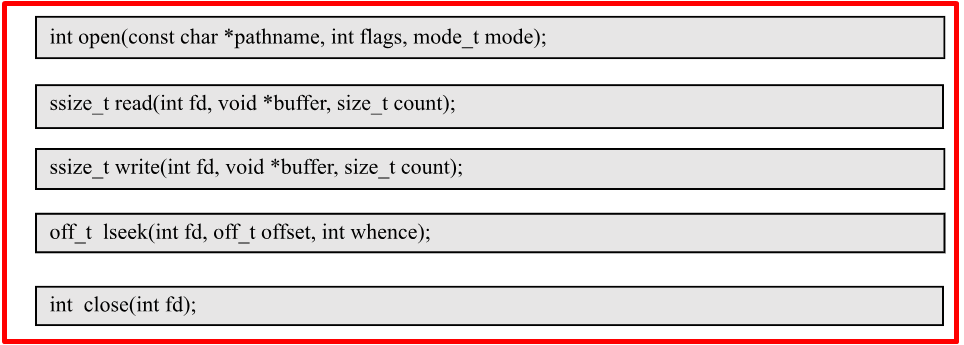   
</p>


+ Ví dụ cơ bản về thao tác đọc ghi file
```s
#include<stdio.h> 
#include<string.h> 
#include<unistd.h> 
#include<fcntl.h> 
  
int main (void) 
{ 
    int fd; 
    int numb_read, numb_write;
    char buf1[12] = "hello world\n"; 
  
    fd = open("hula.txt", O_RDWR | O_CREAT , 0667);         
    if (-1 == fd) 
    { 
        printf("open() hula.txt failed\n");
    }      

    numb_write = write(fd, buf1, strlen(buf1));
    printf("Write %d bytes to hula.txt\n", numb_write);
  
    lseek(fd, 2, SEEK_SET);
    write(fd, "AAAAAAAAAAAA", strlen("AAAAAAAAAAAA"));
    
    close(fd); 
    return 0; 
} 
```

***Quản lý file trong linux***

Kernel điều khiển việc tương tác giữa tiến trình và file thông qua ba bảng:

+ File descriptor table: là bảng nằm trong struct process control block của mỗi tiến trình. Mỗi phần tử được đánh số thứ tự gọi là file descriptor và chứa các thông tin sau
    + Fd Flags: Flag một số mode hoạt động của file description
    + File pointer: chỉ số của phần tử tương ứng trong bảng Open file table
    + struct fd table in include/linux/fdtable.h

+ Open file table: là bảng dùng chung cho tất cả các tiến trình chứa tất cả thông tin của một file đã được mở. Mỗi phần tử được đánh số thứ tự và chứa các thông tin sau
    + Giá trị con trỏ Offset hiện tại của file
    + Trạng thái được set khi mở file
    + Chế độ truy cập (read only, write only …)
    + Chỉ số của phần tử tương ứng trong bảng I-node table
    + struct file in include/linux/fs.h

+ I-node table: là bảng chứa thông tin của tất cả các file trong một file system. Mỗi phần tử của I-node table chứa các thông tin sau
    + File type (regular file, FIFO, socket, . . . ), tài khoản tạo file, phân quyền, kích thước file…
    + Số hard link liên kết tới file
    + Con trỏ tới vùng dữ liệu của file
    + struct inode in include/linux/fs.h

Các bước thực hiện với file trong linux:
+ Bước 1: Kernel tìm i-node number tương ứng với tên file muốn mở (File Directory sẽ chứa thông tin tên file tương ứng với I-node number).

+ Bước 2: Kernel sẽ thêm một phần tử vào bảng Open File Table, các giá trị của phần tử này sẽ được set tương ứng theo các tham số truyền vào hàm open() trong đó có tham số trỏ đến vị trí của file trong bảng i-node.
    + Nếu một file được mở nhiều lần bởi cùng 1 tiến trình hay nhiều tiến trình kernel đều thêm nhiều phần tử vào bảng Open File Table tương ứng với số lần gọi hàm open(). Các phần tử này sẽ cùng chỉ đến một phần tử trên bảng i-node table
    + Số phần tử của bảng Open File Table là giới hạn trước nên một hệ thống chỉ cho phép mở một số lượng file nhất định cùng lúc

+ Bước 3:  Kernel sẽ tìm một phần tử chưa sử dụng trong bảng File Descriptor Table của tiến trình và set giá trị để phần tử này trỏ tới phần tử mới được tạo trong bảng Open File Table. Giá trị trả về của lệnh open() chính là chỉ số của phần tử trong bảng File Descriptor Table.

**NOTE**: Nội dung của file sẽ không được load lên ram trong quá trình open file

<p align="center">
  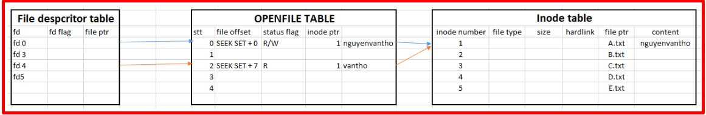   
</p>
<p align="center">
  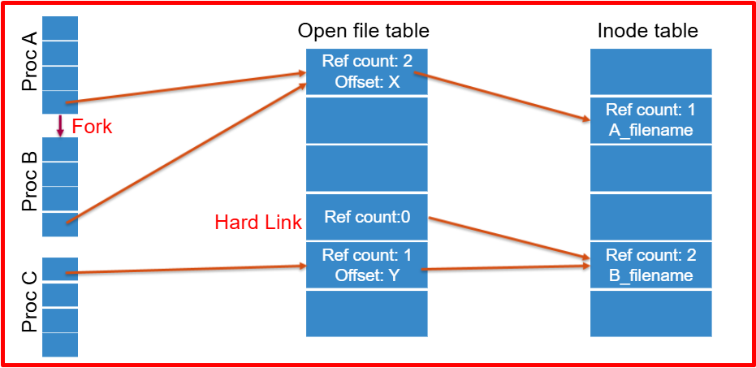   
</p>

+ Mối quan hệ giữa file descriptors and open files
    + Nhiều file descriptors có thể refer đến cùng 1 open file
<p align="center">
  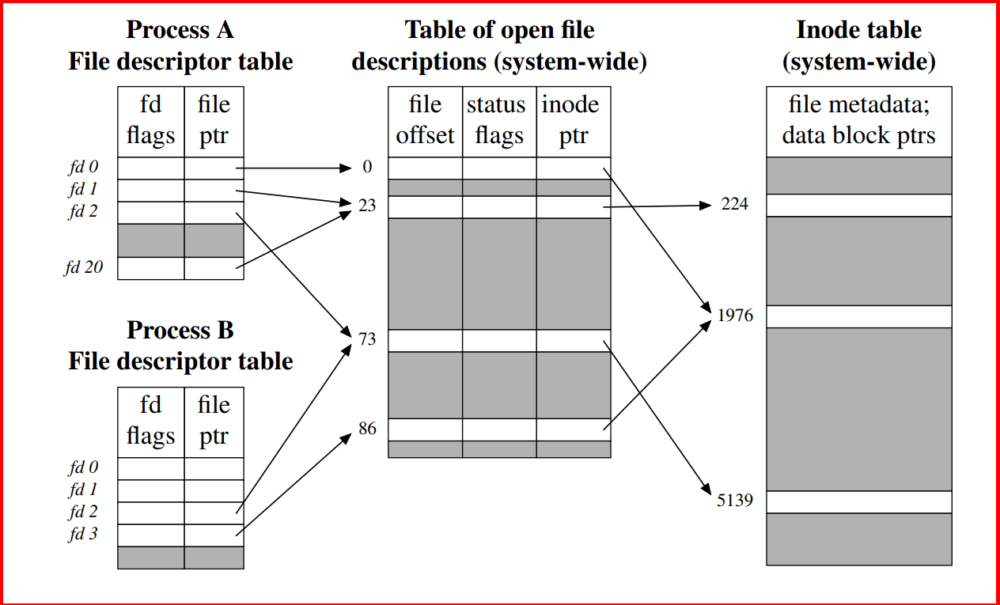   
</p>

+ Duplicated file descriptors: 1 process có thể có nhiều File Descripter cùng refer đến 1 OFD
    + Achieved using dup() or dup2()
<p align="center">
  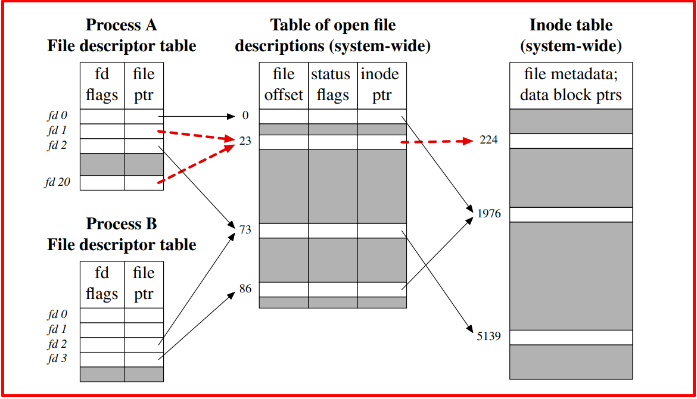   
</p>

+ Duplicated file descriptors between processes
    + 2 process có thể có FD cùng refer đến OFD
    + Có thể xảy ra khi ta dùng fork()
<p align="center">
  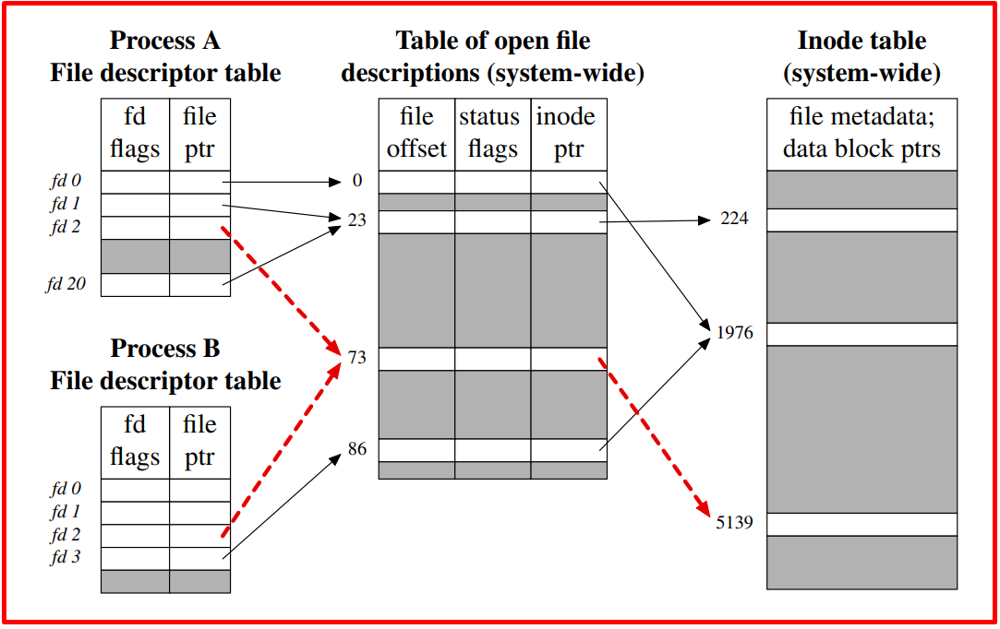   
</p>

+ 2 processes có FDs refer đến 2 OFD rieeg biệt nhưng lại cùng refer tới 1 inode
    + Điều này có thể xảy ra khi 2 process cùng open 1 file
<p align="center">
  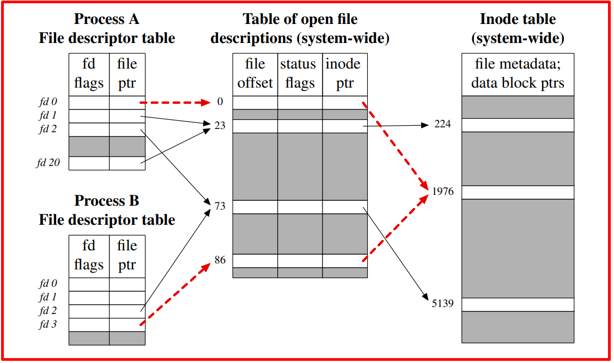   
</p>

+ Duplicating file descriptors sử dụng function dup
```s
#include <unistd.h>
int dup(int origfd);
    + origfd : an existing file descriptor
    + Returns new file descriptor (on success)
    + New file descriptor is guaranteed to be lowest available
```
+ Các FD 0, 1 và 2 thường luôn mở, do đó shell có thể thực hiện chuyển hướng 2>&1 bằng
```s
close(STDERR_FILENO); /* Frees FD 2 */
newfd = dup(STDOUT_FILENO); /* Reuses FD 2 */
```
+ Nhưng nếu FD 0 đã được clode trước đó thì sao? Chúng ta cần một API tốt hơn.
```s
#include <unistd.h>
int dup2(int origfd, int newfd);
    + Tương tự như dup(), nhưng sử dụng newfd cho FD trùng lặp
    + Đóng newfd một cách âm thầm nếu nó đang mở
    + Close + reuse newfd được thực hiện như một atomic step
    + Không làm gì nếu newfd == origfd
    + Returns new file descriptor (i.e., newfd) on success
```

***Page cache***
+ Quá trình Read
  + Khi kernel nhận được yêu cầy read, kernel sẽ read từ page cache. Nếu page tồi tại trong page cache thì thông tin sẽ được đọc thì cache. Ngược lại thì data physical sẽ được ghi lên cache rồi từ cache sẽ được đọc lên lại

+ Quá trình write
  + Kernal sẽ write nội dung tới page cache. Sau đó page cache sẽ được ghi định kì vào bộ nhớ vật lý hoặc sử dụng các lệnh system call sync(), fsync()

<p align="center">
     
</p>

### 3️⃣ File Lock
+ Xét bài toán khi 2 process cùng ghi vào 1 file. Process 1 ghi vào NguyenVanTho, Process 2 ghi vào Hello khi này nếu không có cơ chế gì thì sẽ gây ra luồng data ghi vào file không đúng ý mong muốn. Khi này đối với file chúng ta sẽ có 2 cách để khắc phục hay còn gọi là đồng bộ. Đó là Flock và Fcntl.
+ File locking dùng để quản lý việc nhiều tiến trình cùng đọc/ghi vào 1 file. Cách hoạt động như sau:
  + Bước 1: Ghi trạng thái lock vào I-node của file
  + Bước 2: Nếu thành công thì thực hiện đọc ghi file, nếu không thành công nghĩa là file đang được tiến trình khác sử dụng
  + Bước 3: Sau khi đọc/ghi xong gỡ trạng thái lock ra khỏi I-node của file
<p align="center">
  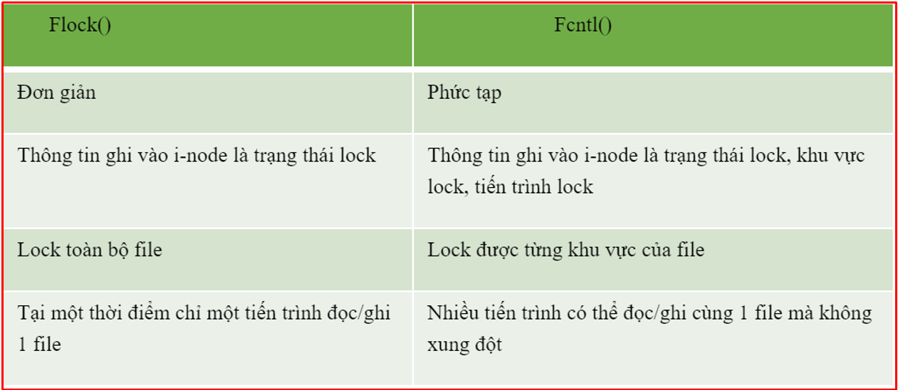   
</p>

***Kĩ thuật Flock()***
+ Flock dựa vào thông tin file descriptor để đặt trạng thái lock vào i-node table
```s
int flock(int fd, int operation);
  + Fd: file descriptor của file cần lock
  + Operation: giá trị lock muốn set
    - LOCK_SH: nếu set giá trị này thành công tiến trình có thể đọc file, không ghi.
    - LOCK_EX: nếu set giá trị này thành công tiến trình có thể đọc ghi file.
    - LOCK_UN: set giá trị này để báo file không bị lock.
    - LOCK_NB: nếu không dùng flag này hàm flock sẽ không kết thúc cho tới khi set được lock.
```
<p align="center">
  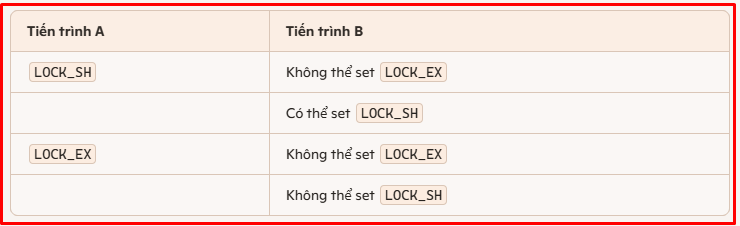   
</p>

**Ví dụ File Lock**
+ Ta chạy Process A trước, khi này Process A sẽ khởi tạo file text.txt và lock file này lại
+ Khi này chạy process B
  + nếu hàm flock mình để là LOCK_EX thì chương trình chạy tới "open file test txt" là dừng lại và đợi cho process A tắt đi thì process B tực hiện tiếp.
  + Còn nếu LOCK_EX | LOCK_NB thì nó bỏ qua luôn

- File Process A
```s
#include <sys/stat.h>
#include <stdio.h>
#include <sys/file.h>
#include <unistd.h>
#include <fcntl.h>

int main(void) 
{
    int fd;
    char text[16] = {0};

    sprintf(text,"hello word\n");
    if((fd=open("./text.txt", O_RDWR|O_CREAT, 0666)) == -1) {
        printf("can not create file \n");
        return 0;
    } else {
        printf("create file text.txt\n");
    }

    if(write(fd, text, sizeof(text)-1) == -1) {
        printf("can not write file \n");
        return 0;
    } else {
        printf("write file \n");
    }

    if(flock(fd, LOCK_SH) == -1) {
        printf("can not set read lock\n");
    } else {
        printf("set read lock\n");
    }
    
    while(1) {
        sleep(1);
    }
    close(fd);
    return 0;
}
```
- File Process B
```s
#include <stdio.h>
#include <sys/stat.h>
#include <sys/file.h>
#include <unistd.h>
#include<fcntl.h>

int main(void) 
{
    int fd;
    char buf[16] = {0};

    if((fd=open("./text.txt",O_RDWR)) == -1) {
        printf("can not open file \n");
        return 0;
    } else {
        printf("open file test.txt \n");
    }

    if(flock(fd, LOCK_EX | LOCK_NB) == -1) {
        printf("can not get write lock\n");
    }
    
    if(flock(fd, LOCK_SH | LOCK_NB) == -1) {
        printf("can not get read lock\n");
    } else {
        printf("get read lock file\n");
        if(read(fd, buf, sizeof(buf)-1) == -1) {
            printf("can not read file \n");
            return 0;
        } else
            printf("%s\n",buf); 
    }

    close(fd);

    return 0;
}

```

***Kĩ thuật Fcntl()***
+ fcntl() cho phép lock từng phần của file (thậm chí đến từng byte). Thông tin lock đặt vào i-node table sẽ gồm process ID, trạng thái lock, vùng lock. Vậy nên fcntl() linh hoạt hơn flock().

```s
fcntl(fd, cmd, &flockstr)
  + fd: file descriptor của file cần lock
  + cmd: action muốn thực hiện
    - F_SETLK: đặt lock, bỏ lock
    - F_GETLK: đọc thông tin lock
  + flockstr: thông tin muốn lock (gồm state lock, vùng muốn lock, process lock) 
```
<p align="center">
  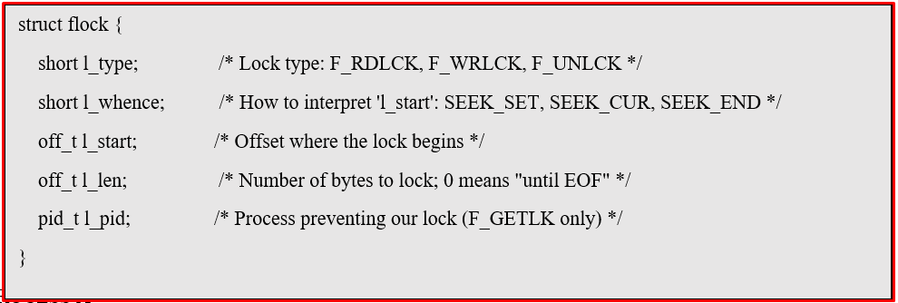   
</p>

**Ví dụ Fcntl**

+ File Process A
```s
#include <stdio.h>
#include <sys/stat.h> 
#include <sys/file.h> 
#include <unistd.h> 
#include <fcntl.h> 

int main(void) 
{ 
  int fd; 
  char text[16] = {0}; 
  struct flock fl; 

  sprintf(text, "hello word\n"); 

  if((fd=open("./test.txt", O_RDWR | O_CREAT, 0666)) == -1) { 
      printf("can not create file \n"); 
      return 0; 
  } else { 
      printf("create file test.txt\n"); 
  } 

  if(write(fd, text , sizeof(text) - 1) == -1) { 
      printf("can not write file \n"); 
      return 0; 
  } else { 
      printf("write file \n");  
  } 

  fl.l_start = 1;         /* Offset where the lock begins */
  fl.l_len = 5;           /* Number of bytes to lock; 0 means "until EOF" */
  fl.l_type = F_WRLCK;    /* Lock type: F_RDLCK, F_WRLCK, F_UNLCK */
  fl.l_whence = SEEK_SET; /* How to interpret 'l_start': SEEK_SET, SEEK_CUR, SEEK_END */

  if(fcntl(fd, F_SETLK, &fl) == -1) { 
      printf("can not set write lock byte 1-5\n"); 
  } else { 
      printf("set write lock byte 1-5 \n"); 
  } 

  while (1) { 
      sleep(1); 
  } 
  close(fd); 
  return 0; 
}
```
+ File Process B
```s
#include <stdio.h>
#include <sys/stat.h> 
#include <sys/file.h> 
#include <unistd.h> 
#include <fcntl.h> 

int main(void) 
{ 
  int fd; 

  char text[10] = {0};  
  struct flock fl; 

  sprintf(text, "thonv12"); 

  if((fd=open("./test.txt", O_RDWR)) == -1) { 
      printf("can not open file \n"); 
      return 0; 
  } else { 
      printf("open file test.txt \n"); 
  } 

  fl.l_start = 1;         /* Offset where the lock begins */
  fl.l_len = 5;           /* Number of bytes to lock; 0 means "until EOF" */
  fl.l_type = F_WRLCK;    /* Lock type: F_RDLCK, F_WRLCK, F_UNLCK */
  fl.l_whence = SEEK_SET; /* How to interpret 'l_start': SEEK_SET, SEEK_CUR, SEEK_END */

  if(fcntl(fd, F_SETLK, &fl) == -1) { 
      printf("can not set write lock byte 0-5\n"); 
  } 

  fl.l_start = 6; 
  fl.l_len = 8; 
  fl.l_type = F_WRLCK; 
  fl.l_whence = SEEK_SET; 

  if(fcntl(fd, F_SETLK, &fl) == -1) { 
      printf("can not set write lock byte 6-11\n"); 
  } else { 
      printf("set write lock byte 6-11\n"); 
      lseek(fd, 6, SEEK_SET);


      if(write(fd, text, sizeof(text) - 1) == -1) { 
          printf("can not write file \n"); 
          return 0; 
      } else {
          printf("write file \n");
      } 
  } 

  close(fd); 
  return 0; 
} 
```
## ✔️ Conclusion
Ở bài này chúng ta đã tìm hiểu về Virtal File System, File System và File Locking. Đây là bài quan trọng và hay. Sau này chúng ta sẽ gặp file operation rất nhiều nên cần nắm chắc bài này để dễ dàng hơn cho các bài sau.

## 💯 Exercise
<p align="center">
  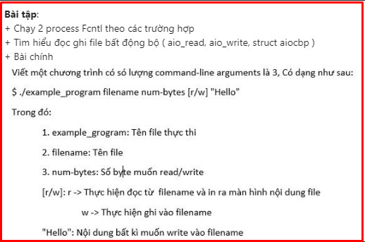   
</p>


## 📺 NOTE

+ Video : [Video Youtube](https://www.youtube.com/watch?v=ut1P9HPazxI)


## 📌 Reference

[1] Understanding Linux kernel, 3rd Ed

[2] https://viblo.asia/p/hard-links-va-symbolic-links-tren-linux-07LKXJR2lV4

[3] https://www.nixtutor.com/freebsd/understanding-symbolic-links/ 

[4] https://man7.org/linux/man-pages/man2/open.2.html 

[5] https://www.joyk.com/dig/detail/1608468062718245​

[6] https://man7.org/training/download/lusp_fileio_slides.pdf
