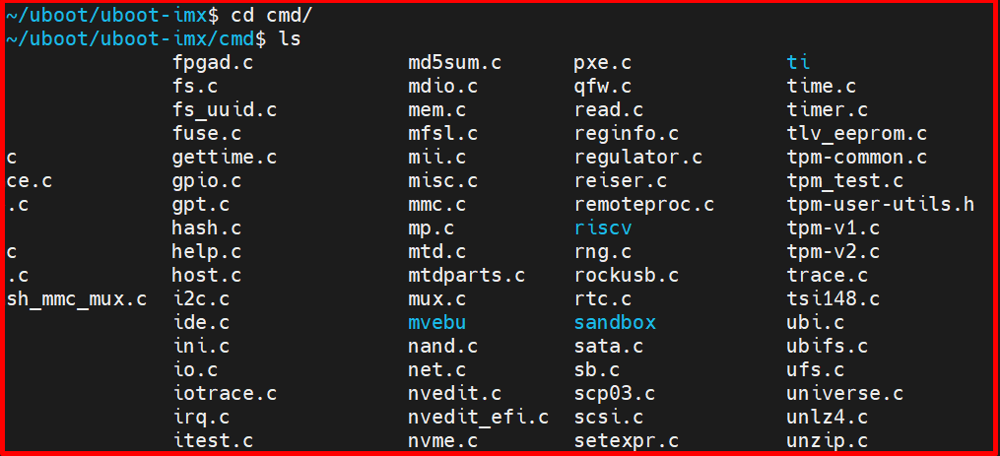
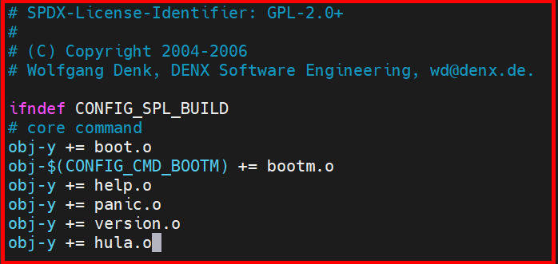
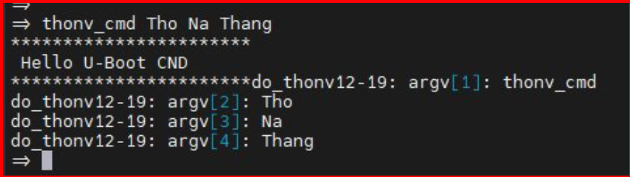
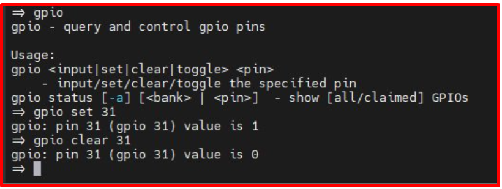
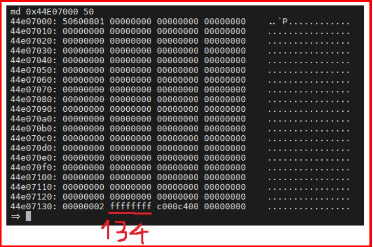
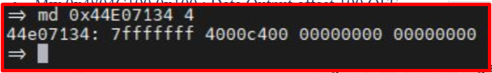
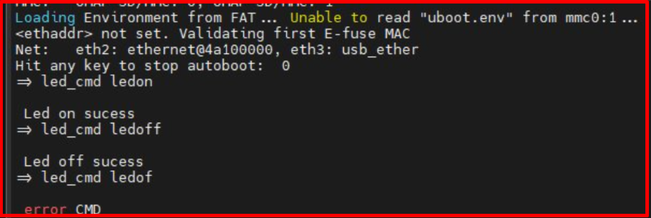
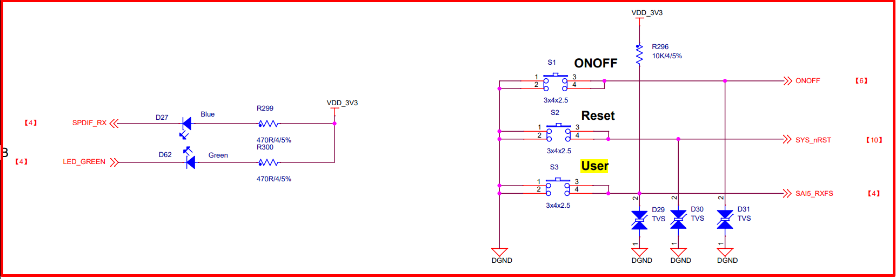
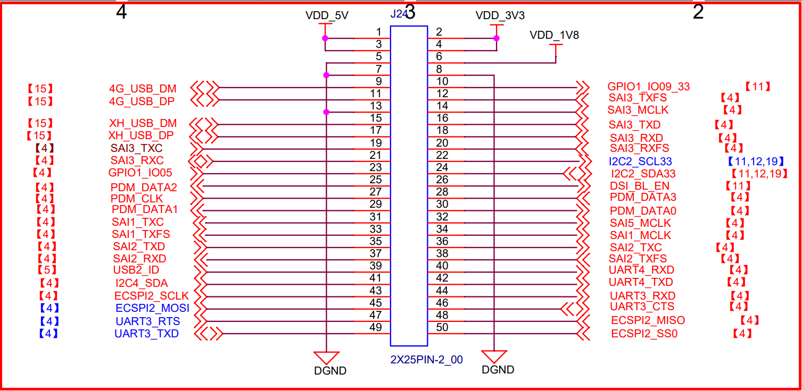

# 💚 Practice Uboot CMD 💛

## 👉 Introduction and Summary

### 1️⃣ Introduction

+ Ở bài trước chúng ta đã build được uboot và boot trên board. Nếu các bạn chưa đọc thì xem link này nha [017_Uboot_Practice_Imx8mm.md](../017_Uboot_Practice_Imx8mm/017_Uboot_Practice_Imx8mm.md). Ở bài này chúng ta sẽ tìm hiểu về cách tạo 1 cmd mới trong uboot và blynk led trên uboot nhé.

### 2️⃣ Summary

Nội dung của bài viết gồm có những phần sau nhé 📢📢📢:
- [I. Introduction and Summary](#👉-introduction-and-summary)

    - [1. Introduction](#1️⃣-introduction)
    - [2. Summary](#2️⃣-summary)
- [II. Contents](#👉-contents)
    - [1. Command uboot](#1️⃣-command-uboot)
    - [2. Create a command uboot](#2️⃣-create-a-command-uboot)
    - [3. Uboot Gpio](#3️⃣-uboot-gpio)
    - [4. Command uboot blynk led](#4️⃣-command-uboot-blynk-led)
- [III. Conclusion](#✔️-conclusion)
- [IV. Exercise](#💯-exercise)
- [V. NOTE](#📺-note)
- [VI. Reference](#📌-reference)

## 👉 Contents

### 1️⃣ Command uboot
+ Trong uboot sẽ có các command mặc định như help, printenv, saveenv... Tất cả các command này sẽ nằm trong thư mục uboot-imx/cmd

<p align="center">
     
</p>

### 2️⃣ Create a command uboot
***Để tạo 1 command uboot ta làm theo các bước sau:***
1. Trong folder uboot-imx/cmd ta tạo 1 file ví dụ hula.c
```s
$ cd uboot-imx/cmd
$ touch hula.c
```

2. Nội dung của file hula.c sẽ như sau
```s
#include <common.h>
#include <command.h>

#define CONFIG_MAX_ARGS 4
#define CONFIG_REPEATAVLE 1
#define USAGE "print hello hula"
#define HELP "u-booot hello hula command line help"

int do_hula(struct cmd_tbl *cmdtp, int flag, int argc, char * const argv[])
{
    int i;
    printf("***********************");
    printf("\n Hello U-Boot HuLa CMD \n");
    printf("***********************");

    for( i = 0; i< argc;i++)
    {
        printf("%s-%d: argv[%d]: %s\n",__func__, __LINE__, i+1, argv[i]);
    }
    return 1;
}

U_BOOT_CMD(
        hula_cmd,CONFIG_MAX_ARGS, CONFIG_REPEATAVLE, do_hula,
        USAGE,
        HELP
);
```

3. Sau đó ở trong folder uboot-imx/cmd ta mở file Makefile lên và thêm command ta mới tạo vào
```s
$ cd uboot-imx/cmd
$ vim Makefile
$ obj-y += hula.o
```
<p align="center">
     
</p>

4. Sau đó ta đi build lại uboot
```s
$ cd uboot-imx
$ make clean
$ make imx8mm_ddr4_evk_defconfig
$ make -j16
```

5. Boot board và vào uboot, ta gõ hula_cmd sẽ in ra kết quả
```s
$ hula_cmd hulatho
```
<p align="center">
     
</p>

### 3️⃣ Uboot Gpio
+ Khi đã vào uboot trong boot board ta có thể thực hiện nháy led bằng thao tác với gpio command. Làm theo hình bên dưới
+ Trên board Myir IMX8MM có Two LEDs (User LED – Blue, System indicator – Green). User Led được nối tới chân GPIO1_IO5 là Pin 11 của J7 trên board
+ Tính theo integer thì GPIO1_IO5 sẽ tương ứng với số 37

<p align="center">
     
</p>


### 4️⃣ Command uboot blynk led
***Các command read write thanh ghi***
+ md: memory display​
+ mw: memory write​
+ [.b, .w, .l] byte/word/long
+ mw.l 0x81000000 0x8
+ md.l 0x81000000 0x8​

+ Ví dụ:
  + md 0x4804C000 4
  + mw 0x4804C134 0xFFFDFFFF​
  + md 0x44E07134 4: xem địa chỉ 0x44E07134​

***Dưới đây là ví vụ cho sáng led GPIO0_31 trong BBB***
+ Các thanh ghi:
  + Xét GPIO0_31​
  + GPIO_O_ADDRESS_BASE 0x44E07000​
  + Cho GPIO_OE số 31 về 0 để là output, Offset OE là 0x134​
  ==> Địa chỉ là 0x44E07134
+ Cần set
  + Mw 0x4804C134 0xFFFFFEFF​
  + Mw 0x4804C194 0x100 : Data Output offset 194 ON​
  + Mw 0x4804C190 0x100 : Data Output offset 190 OFF

<p align="center">
     
</p>
<p align="center">
     
</p>

+ Từ ý tưởng dùng thanh ghi và câu lệnh như trên, ta sẽ viết command để thực hiện sáng tắt led
  + Gõ led_on thì led sáng
  + Gõ led_off thì led tắt

```s
/**Use comand line u-boot on, off led
 * GPIO50
 * cmd: led_cmd LED_ON  => led on
 *      led_cmd LED_OFF => led off
**/
#include <common.h>
#include <command.h>
#include <string.h>
#include <stdint.h>

#define CONFIG_MAX_ARGS 4
#define CONFIG_REPEATAVLE 1
#define USAGE "print toogle led Linux"
#define HELP "u-booot hello command line"
#define GPIO_OE_OFFSET			              (uint32_t)0x134
#define GPIO_DATAOUT_OFFSET				        (uint32_t)0x194
#define GPIO_CLEARDATAOUT_OFFSET			    (uint32_t)0x190

volatile uint32_t  *base_addr = (uint32_t*)0x4804C000; /*Base adrress for GPIO*/

int do_toggle_led(struct cmd_tbl *cmdtp, int flag, int argc, char * const argv[])
{  
    char *mode = argv[1];

   if(strcmp(mode, "LED_ON") == 0)
   {
      *(base_addr + GPIO_OE_OFFSET /4) |= 0xFFFBFFFF;
      *(base_addr + GPIO_DATAOUT_OFFSET /4) |= 0x40000;  /*Data Output for GPIO50*/
      printf("\n Led on sucess \n");
   }
   else if(strcmp(mode, "LED_OFF") == 0) 
   {
      *(base_addr + GPIO_CLEARDATAOUT_OFFSET /4) |= 0x40000; /*Clear Data Output GPIO50*/
      printf("\n Led off sucess \n");
   }
   else
   {
     printf("\n error CMD \n");
   }
    return 1;
}

U_BOOT_CMD(
      led_cmd,CONFIG_MAX_ARGS, CONFIG_REPEATAVLE, do_toggle_led,
      USAGE,
      HELP
);
```

<p align="center">
     
</p>

## ✔️ Conclusion
Ở bài này chúng ta đã biết cách tạo 1 command line trên uboot và test trên board. Tiếp theo chúng ta cùng đi build yocto cho board myir imx8mm nhé.

## 💯 Exercise
+ Từ command line đó có thể bật sáng hoặc tắt led, ví dụ led on thì bật led còn nhập led off thì tắt led.

## 📺 NOTE
+ Xem video sau để trực quan hơn nhé : [Video Youtube](https://www.youtube.com/watch?v=qzUfeBrt8Bg)

<p align="center">
     
</p>

<p align="center">
     
</p>

## 📌 Reference

[1] MYS-8MMX-V2 Product Manual-V2.0.pdf

[2] https://github.com/nxp-imx

[3] https://github.com/MYiR-Dev

[4] i.MX_Linux_User's_Guide.pdf