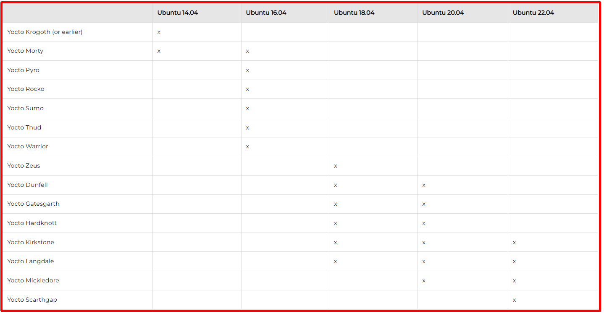
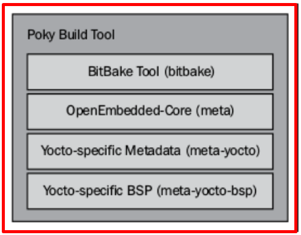
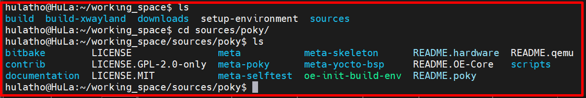
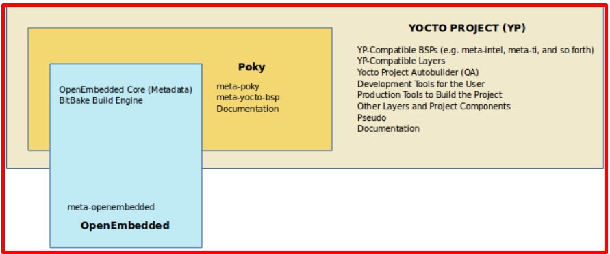
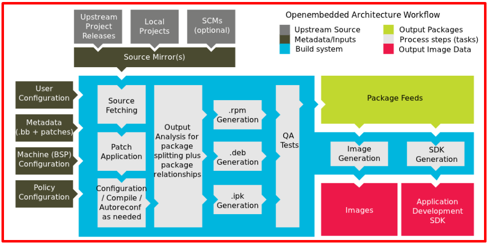
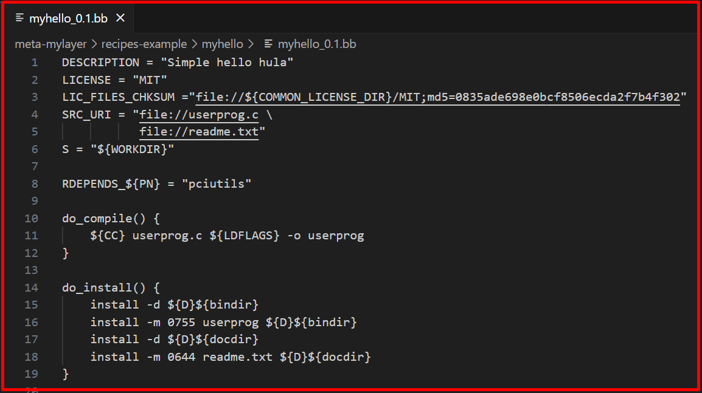
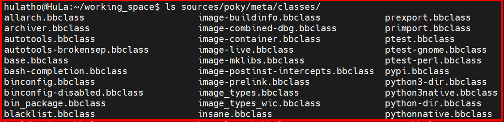
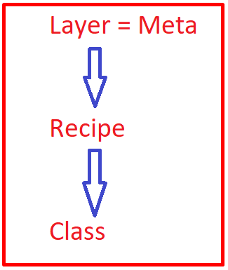
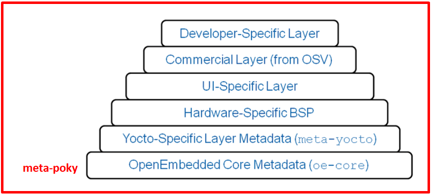
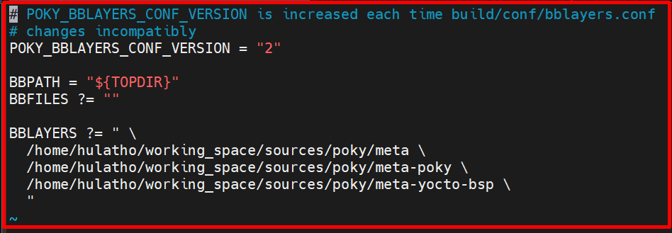

# 💚 Yocto Project 💛

## 👉 Introduction and Summary

### 1️⃣ Introduction

+ Ở bài trước chúng ta đã build yocto cho board myir imx8mm. Nếu các bạn chưa đọc thì xem link này nha [019_Build_Yocto_Imx8mm.md](../019_Build_Yocto_Imx8mm/019_Build_Yocto_Imx8mm.md). Ở bài này chúng ta sẽ tìm hiểu lý thuyết và thực hành liên quan về yocto nhé.

### 2️⃣ Summary

Nội dung của bài viết gồm có những phần sau nhé 📢📢📢:
- [I. Introduction and Summary](#👉-introduction-and-summary)

    - [1. Introduction](#1️⃣-introduction)
    - [2. Summary](#2️⃣-summary)
- [II. Contents](#👉-contents)
    - [1. Giới thiệu Yocto](#1️⃣-giới-thiệu-yocto)
    - [2. Custom Yocto](#2️⃣-custom-yocto)
- [III. Conclusion](#✔️-conclusion)
- [IV. Exercise](#💯-exercise)
- [V. NOTE](#📺-note)
- [VI. Reference](#📌-reference)

## 👉 Contents

### 1️⃣ Giới thiệu Yocto
+ Dự án Yocto là một dự án mã nguồn mở có mục tiêu là cung cấp các công cụ giúp xây dựng các hệ thống nhúng hoạt động trên hệ điều hành Linux với bất kì phần cứng nào

+ Được thành lập vào năm 2010, với nỗ lực giảm thiểu sự trùng lặp trong công việc, cung cấp tài nguyên và thông tin phục vụ cho cả người dùng mới và người dùng có kinh nghiệm

+ Là sự hợp tác của nhiều nhà sản xuất phần cứng, các nhà cung cấp hệ điều hành nguồn mở và các công ty điện tử

+ Yocto Project là được hợp thành từ nhiều dự án mã nguồn mở nhỏ hơn như Poky, BitBake và OpenEmbedded-Core

***Ưu điểm***
+ Được áp dụng rộng rãi trong toàn ngành: Có các nhà cung cấp chất bán dẫn, hệ điều hành, phần mềm và dịch vụ có sản phẩm và dịch vụ áp dụng và hỗ trợ Dự án Yocto.Ví dụ. Intel, Facebook, Juniper Networks, LG, AMD, NXP, DELL

+ Architecture : hỗ trợ Intel, ARM, MIPS, AMD, PPC và các kiến trúc khác , các nhà cung cấp chip tạo và cung cấp BSP hỗ trợ phần cứng của họ, nếu ta có silicon tùy chỉnh, ta có thể tạo BSP hỗ trợ kiến trúc đó. Dự án Yocto hỗ trợ đầy đủ nhiều loại mô phỏng thiết bị thông qua EMUlator nhanh (QEMU)

+ Tính linh hoạt: Thông qua cấu hình tùy chỉnh và phân lớp, các dự án có thể tận dụng bản phân phối Linux cơ bản để tạo ra bản phân phối phù hợp với nhu cầu sản phẩm của họ.

+ Sử dụng mô hình layer: Cơ sở hạ tầng lớp Dự án Yocto nhóm chức năng liên quan thành các gói riêng biệt. Ta có thể dần dần thêm các chức năng được nhóm này vào dự án của mình nếu cần. Cho phép ta dễ dàng mở rộng hệ thống, thực hiện các tùy chỉnh và sắp xếp chức năng

***Version Yocto***
+ Check link sau để biết về các version yocto [LINK](https://wiki.yoctoproject.org/wiki/Releases)
+ Mỗi version yocto sẽ đi kèm theo là 1 bản ubuntu hỗ trợ, nên ta cần kiếm tra xem ta đang muốn dùng bản yocto nào để từ đó cài đặt ubuntu cho phù hợp. Check link sau để biết version nào đi kèm với yocto version nào, tính đến năm 2025 [LINK](https://dev.variscite.com/dart-mx8m-plus/yocto/yocto-development-environment/)

<p align="center">
     
</p>

***Các khái niệm***

+ Giao thức hiển thị đồ họa: X11, Wayland, v.v.
+ Các thư viện đồ họa: CGI, Kanzi, Qt,  v.v.
+ Build system đầu tiên xuất hiện là Buildroot
  + Mục tiêu ban đầu của Buildroot là sử dụng để build “root filesystems”
  + Buildroot dựa trên cấu trúc của Makefile, kconfig (công cụ cấu hình) và các bản vá lỗi cho các gói phần mềm khác nhau. 
  + Nhưng đến ngày này, ngoài việc dùng để build “root filesystems” thì Buildroot còn có thể được sử dụng để build “kernel” và “bootloader”.

+ Ra đời sau Buildroot không lâu là OpenEmbedded (viết tắt là OE)
  + Là công cụ để tạo ra các Linux distro
  + Sử dụng BitBake để thông dịch các files được gọi là các “recipes”
  + Một tính năng thú vị về OpenEmbedded là các “recipes” có thể chỉ định “dependencies” giữa các “packages”
  + BitBake sẽ phân tích tất cả các “recipes” và tạo ra một hàng đợi các “nhiệm vụ” – “tasks” cần phải làm theo đúng thứ tự

+ Một bản phân phối dựa trên OpenEmbedded khác là Poky Linux

***Poky là gì?***
+ Poky bao gồm OpenEmbedded Build System (BitBake + OpenEmbedded-Core) và một bộ các metadata mặc định có sẵn (bao gồm các recipes, các file cấu hình…) giúp chúng ta có thể bắt đầu build các Linux software packages của riêng mình

+ Poky = Bitbake + Metadata

+ Poky là một bản reference distro ví dụ của Yocto Project

+ Dự án Yocto sử dụng Poky để xây dựng hình ảnh (nhân, hệ thống và phần mềm ứng dụng) cho phần cứng được nhắm mục tiêu

+ Ở cấp độ kỹ thuật, nó là kho lưu trữ kết hợp của các thành phần
  + Bitbake
  + OpenEmbedded Core
  + meta-yocto-bsp
  + Documentation

+ Poky cho phép tạo ra một bộ công cụ hỗ trợ phát triển phần mềm (SDK – Software Development Kit) dành riêng  cho bản distro của ta. SDK này có thể được các engineers khác sử dụng để biên dịch các ứng dụng mà sau này sẽ chạy trên hệ thống Linux của ta

+ Sự khác biệt chính xác giữa Yocto và Poky là Yocto đề cập đến tổ chức (giống như người ta nói đến “Canonical”, công ty đứng sau Ubuntu) và Poky thì là 'Ubuntu'

+ Một số trường hợp thì metadata có sẵn của Poky không đủ để build ra software nên cần lấy từ nguồn khác bỏ vào ( ví dụ meta-ti...)
<p align="center">
     
</p>

+ Các Linux software packages có thể build dùng Poky bao gồm 
  + Bootloader Linux kernel 
  + Root filesystems 
  + Toolchains và Software Development Kits (SDKs) 

+ Ta mở folder source/poke lên sẽ thấy các file như ảnh dưới

<p align="center">
     
</p>

***Metadata là gì***
+ Metadata là một tập dữ liệu mô tả và cung cấp thông tin về dữ liệu khác
+ Yocto sẽ chứa:
  + Metadata đề cập đến hướng dẫn xây dựng
  + Các lệnh và dữ liệu được sử dụng để cho biết phiên bản phần mềm nào được sử dụng và Chúng được lấy từ đâu
  + Những thay đổi hoặc bổ sung cho chính phần mềm (patches ) được sử dụng để sửa lỗi hoặc tùy chỉnh phần mềm để sử dụng trong một tình huống cụ thể
+ Metadata là tập hợp:
  + Configuration file (.conf)
  + Recipes( .bb and .bbappend)
  + Classes (.bbclass)
  + Include (.inc)

***OpenEmbedded là gì***
+ OpenEmbedded cung cấp môi trường biên dịch chéo tốt nhất. Nó cho phép ta tạo một bản phân phối Linux hoàn chỉnh cho các hệ thống nhúng.

+ Yocto project và OpenEmbedded chia sẻ một bộ sưu tập meta data cốt lõi được gọi là openembedded-core.

+ OpenEmbedded cung cấp một metadata toàn diện cho nhiều kiến trúc, tính năng và ứng dụng khác nhau

+ Yocto project tập trung vào việc cung cấp các công cụ, metadata và gói hỗ trợ bo mạch (BSP) mạnh mẽ, dễ sử dụng, có thể tương tác, được kiểm tra kỹ lưỡng cho một bộ kiến trúc cốt lõi và các bo mạch cụ thể.

+ Dự án Yocto và OpenEmbedded đã đồng ý hợp tác cùng nhau và chia sẻ một bộ metadata cốt lõi chung (recipes, classes và các tệp liên quan) là oe-core

***Bitbake***
+ Bitbake là thành phần cốt lõi của Dự án Yocto.

+ Về cơ bản nó thực hiện chức năng tương tự như make.

+ Đó là một công cụ lập lịch tác vụ phân tích mã hỗn hợp tập lệnh python và shell

+ Code được phân tích cú pháp sẽ tạo và chạy các tác vụ, về cơ bản là một tập hợp các bước được sắp xếp theo sự phụ thuộc của mã.

+ Nó đọc các recipes (công thức nấu ăn) và làm theo chúng bằng cách tìm nạp các gói, xây dựng chúng và kết hợp kết quả vào các image có thể khởi động.

+ Nó theo dõi tất cả các tác vụ đang được xử lý để đảm bảo hoàn thành, tối đa hóa việc sử dụng tài nguyên xử lý để giảm thời gian xây dựng và có thể dự đoán được.

***Meta-yocto-bsp***
+ A Board Support Package (BSP) là tập hợp thông tin xác định cách hỗ trợ một thiết bị phần cứng, bộ thiết bị hoặc nền tảng phần cứng cụ thể
+ BSP bao gồm thông tin về các tính năng phần cứng có trên thiết bị và thông tin cấu hình hạt nhân cùng với bất kỳ trình điều khiển phần cứng bổ sung nào được yêu cầu.
+ BSP cũng liệt kê bất kỳ thành phần phần mềm bổ sung nào được yêu cầu ngoài ngăn xếp phần mềm Linux chung cho cả các tính năng nền tảng thiết yếu và tùy chọn.
+ Lớp meta-yocto-bsp trong Poky duy trì một số BSP như Beaglebone, EdgeRouter và các phiên bản chung của cả máy IA 32 bit và 64 bit.
+ Các machine được hỗ trợ:
  + Texas Instruments BeagleBone (beaglebone)
  + Freescale MPC8315E-RDB (mpc8315e-rdb)
  + Intel x86-based PCs and devices (genericx86 and genericx86-64)
  + Ubiquiti Networks EdgeRouter Lite (edgerouter)
+ Lưu ý: Để phát triển trên các phần cứng khác nhau, ta sẽ cần bổ sung cho Poky các lớp Yocto dành riêng cho phần cứng

***Meta-poky***
+ Meta-poky, là siêu dữ liệu dành riêng cho Poky
+ Tài liệu chứa các tệp nguồn Dự án Yocto được sử dụng để tạo bộ hướng dẫn sử dụng.
+ Poky includes: 
  + Some OE components(oe-core)
	+ Bitbake
	+ Demo-BSP's
	+ Helper scripts to setup environment
	+ Emulator QEMU to test the image
<p align="center">
     
</p>

***Workflow of Yocto Project***
```s
Mkdir source
Cd source
Step 1: Download the Poky Source code
  $ git clone git://git.yoctoproject.org/poky
Step 2: Checkout the latest branch/release (zeus)
  $ git checkout zeus 
Step 3: Prepare the build environment
  Poky cung cấp cho bạn tập lệnh 'oe-init-build-env', tập lệnh này sẽ được sử dụng để thiết lập môi trường xây dựng,
  script sẽ thiết lập môi trường của ta để sử dụng hệ thống xây dựng Yocto bao gồm thêm BitBake vào đường dẫn của ta
  $ source source/poky/oe-init-build-env [ build_directory ] (../build)
  echo $PATH : xem đường dẫn ta vừa add
  Ở đây build_directory là một đối số tùy chọn cho tên của thư mục nơi môi trường được đặt, nó mặc định là "build"
  Đoạn script trên sẽ chuyển ta vào build folder và tạo hai tệp (local.conf, bblayers.conf) bên trong thư mục conf
Step 4: Building Linux Distribution
  $ bitbake <image_name>
  $ time bitbake core-image-minimal
  core-image-minimal là một image nhỏ cho phép thiết bị khởi động và nó rất hữu ích cho việc kiểm tra và phát triển kernel và bootloader
```

***Run the generated image in QEMU***
+ Sau khi build core-image-minimal ra image thành công, ta có thể chạy image đó với QEMU để test thử, thay vì phải nạp vào mạch thật rắc rối
+ Quick Emulator ( QEMU ) là gói phần mềm mã nguồn mở và miễn phí thực hiện ảo hóa phần cứng.
+ Hiện nay mô phỏng được hỗ trợ cho: ARM, MIPS, MIPS64, PowerPC, X86, X86_64...
+ Poky cung cấp tập lệnh 'runqemu' cho phép ta khởi động QEMU bằng hình ảnh do yocto tạo
+ Tập lệnh runqemu được chạy dưới dạng:
```s
runqemu <máy> <zimage> <hệ thống tập tin>
  <machine> là kiến trúc sẽ sử dụng (qemuarm/qemumips/qemuppc/qemux86/qemux86-64)    
  <zimage> là đường dẫn đến kernel (ví dụ zimage-qemuarm.bin)    
  <filesystem> là đường dẫn đến image ext2 (ví dụ: filesystem-qemuarm.ext2) hoặc thư mục nfs
```

+ Thoát QEMU bằng cách nhấp vào biểu tượng tắt máy hoặc bằng cách nhập Ctrl C trong QEMU
+ Tóm tắt các câu lệnh chạy:
```s
$ nproc: kiểm tra có bao nhiêu core
$ free –m : kiểm tra ram
$ cd build
$ runqemu qemux86-64 core-image-minimal
```

***Steps to Generate ARM image and Run in QEMU***
+ Khi ta thiết lập môi trường xây dựng, tệp cấu hình cục bộ có tên local.conf sẽ có sẵn trong thư mục con conf của Build Directory
+ Các giá trị mặc định được đặt để xây dựng cho target qemux86-64, ta sẽ sửa lại thành qemuarm
```s
$ vim ./build/conf/local.conf
Tìm biến MACHINE và set MACHINE = "qemuarm"
$ source poky/oe-init-build-env
$ bitbake core-image-minimal
$ runqemu core-image-minimal
```

***Không sử dụng Graphic***
+ Khi ta chạy lệnh "runqemu core-image-minimal" thì mặc định nó sẽ mwor lên cả 1 cái giao diện nữa, tuy nhiên ta không cần cái giao diện qq này. Ta sẽ đi tắt đi bằng cách thêm vào trong command nographic
```s
$ runqemu core-image-minimal nographic
$ poweroff
```

***Thêm 1 Package vào root file system***
+ Để thêm một Package cụ thể vào root file system ta làm như sau:
```s
Mở tệp local.conf của ta và thêm tên công thức bên dưới
IMAGE_INSTALL += "recipe-name"
Ví dụ: IMAGE_INSTALL += "usbutils" or IMAGE_INSTALL_append = " usbutils"
$ runqemu core-image-minimal nographic
```
<p align="center">
     
</p>

***Recipes là gì***
+ Tập hợp các hướng dẫn mô tả cách chuẩn bị hoặc làm 1 món gì đó
+ Tuy nói nó là 1 tập hợp các hướng dẫn nhưng nó được đọc và xử lý bởi bitbake
+ Vì vậy tập hợp các hướng dẫn được bitbake xử lý, thì ta gọi là recipes trong yocto
+ Đuôi là .bb
+ 1 Recipes sẽ chứa các thông tin sau:
  + Nơi ta có thể lấy source code
  + Tất cả các bản vá (patchs) phải áp dụng sau khi tải mã nguồn về
  + Cách cấu hình code (config option)
  + compile option (library dêpndencies)
  + Install
  + License
+ Sau khi có thông tin ở trên xong thì bitbake sẽ tạo ra 1 tập hợp các nhiệm vụ được sắp xếp và sẽ thực hiện những nhiệm vụ này
+ Ví dụ về 1 recipe cơ bản
<p align="center">
     
</p>

***Configuration file***
+ Đuôi file sẽ là .conf
+ Các file config chứa:
  + định nghĩa chung của các biến
  + Chứa các biến do người dùng xác định
  + 1 số chứa thông tin cấu hình phần cứng
+ Các Configuration file này được hệ thống sử dụng để build và tạo image cho 1 phần cứng cụ thể
+ Nó đọc file này để biết sẽ xây dựng cái gì và image nào để tạo ra những gì cần có trong rootfs, bootloader nào sẽ tạo...
+ Có các loại file config khác nhau:
  + Machine Configuration Option
  + Distribution Configuration Options
  + Compiler turing Otion
  + General Common Configuration Optiton
  + User Configuration Option (local .conf)

***Class file là gì***
+ File Class được sử dụng theo chức năng chung trừu tượng và chia sẻ nó giữa nhiều tệp công thức (.bb)
+ Để sử dụng Class file, ta chỉ cần đảm bảo rằng recipe kế thừa Class đó là được
+ Đuôi: .bbclass
+ Chúng thường được đặt trong thư mục class bên trong thư mục meta (poky/meta/classes)
+ Ví dụ class:
  + cmake.bbclass: thực hiện cmake trong recipes
  + kernel.bbclass: thực hiện build kernel, chứa code để build all kernel tree
<p align="center">
     
</p>

***Layers là gì***
+ Việc đưa toàn bộ project của ta vào một Layer bị giới hạn và làm phức tạp việc custom và tái sử dụng trong tương lai.
+ Là 1 bộ tập hơp các recipes có liên quan đến nhau hoặc là nơi chứa recipe
+ Quy ước đặt tên điển hình: meta-<layername>
+ Poky có các Layer sau: meta, meta-poky, meta-selftest, meta-skeleton, meta-yocto-bsp
+ Layer cung cấp một cơ chế để tách biệt meta data theo chức năng, ví dụ như BSP, distribution configuration, v.v. Ta có thể có layer BSP, Layer GUI, Configuration distribute, middleware hoặc Aplication.
+ Ví dụ: 
  + meta-poky: Siêu dữ liệu của Distro          
  + meta-yocto-bsp: siêu dữ liệu BSP
+ Các layer cho phép dễ dàng thêm toàn bộ meta data và/hoặc thay thế các bộ bằng các bộ khác
+ Meta-poky: bản thân nó là một Layer được áp dụng trên layer metadata OE-Core

<p align="center">
     
</p>

<p align="center">
     
</p>

+ Câu hỏi đặt ra: Những lớp nào được sử dụng bởi hệ thống xây dựng Poky?
  + Ta sẽ có biến BBLAYERS có trong file build/conf/bblayers.conf liệt kê các LAYER mà Bitbake sẽ dùng
  + Nếu bblayers.conf không xuất hiện khi ta khởi động build, hệ thống build OpenEmbedded sẽ tạo nó từ bblayers.conf.sample khi ta chạy lệnh oe-init-build-env
  + Ta có thể cung cấp bblayers.conf khác bằng cách dùng câu lệnh sau
    > TEMPLATECONF=$PWD/meta-renesas/meta-rz-distro/conf/templates/rz-conf/ source poky/oe-init-build-env build
  + Lệnh để tìm đang có những layer nào
    > $ bitbake-layers show-layers
  + Để thêm 1 layer mới thì ta mở file build/conf/bblayers.conf và thêm vào đây

<p align="center">
     
</p>


### 2️⃣ Custom Yocto

## ✔️ Conclusion
Ở bài này chúng ta đã biết các kiến thức về yocto và thực hành xung quanh yocto. Tiếp theo chúng ta cùng đi tìm hiểu lý thuyết về linux kernel nhé.

## 💯 Exercise
+ Thực hành lại theo bài viết

## 📺 NOTE
***Tổng hợp các comamnd hay dùng trong yocto***
```s
$ source source/poky/oe-init-build-env [ build_directory ] (../build)
$ git checkout zeus
$ bitbake core-image-minimal
$ nproc: kiểm tra có bao nhiêu core 
$ free –m : kiểm tra ram 
$ runqemu qemux86-64 core-image-minimal
$ nographic
$ poweroff
$ bitbake-layers show-layers
$ bitbake-layers add-layer /home/thonv12/yocto_bbb/meta-ti
```

+ Có 2 cái thay đổi chính trong linux BSP là version yocto và version kernel. Link docs kernel [LINK](https://docs.kernel.org/driver-api/gpio/driver.html)

+ Video yocto part 1: [Video](https://www.youtube.com/watch?v=y4CshZ8-qZo)
+ Video yocto part 2: [Video](https://www.youtube.com/watch?v=qeuKi8_doug)
+ Video yocto part 3: [Video](https://www.youtube.com/watch?v=L7qzXkHmFVc)

## 📌 Reference

[1] Embedded Linux Projects Using Yocto Project Cookbook

[2] https://www.youtube.com/playlist?list=PLwqS94HTEwpQmgL1UsSwNk_2tQdzq3eVJ

[3] https://docs.yoctoproject.org/ref-manual/#ubuntu-packages
